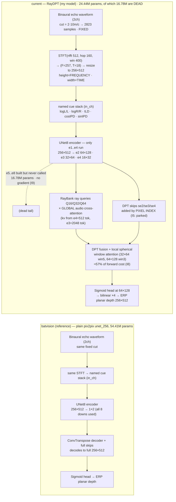

# Auto Audio Depth Estimation

Autonomous research — binaural echoes → ERP planar (cubemap) depth (SoundSpaces).

<!-- RESEARCH:START -->
## Autonomous research state

| | |
|---|---|
| **Mode** | `VERIFY` — clean reimplementation on the correct parent -> standalone run -> bounded HPO -> PASS / FAIL |
| **Active study** | `S5` [verify] raydpt-capacity (*running*) |
| **Research question** | D9 claims RayDPT's entire deficit against the reference is ANGULAR (d1), which would indict ray-conditioning at exactly the point it claims to win. But that claim rests on models that never finished l |
| **Current action** | E11 raydpt_e11_d32L2_kve4: --decode-scale 32 --ray-cross-layers 2 --cross-kv32 e4 --batch-size 64 --lr 1.2e-3 --amp bf16 --epochs 24. |
| **Latest result** | *(no scored run in this study yet)* |
| **Next decision** | Convergence first: best_epoch must not be the last, or the run answers nothing (as E10 did). Then read d1, NOT the composite -- D9 is an angular claim. Caveat to honour: kv=e4 is a mechanism change, s |
| **Why this mode** | DC1 chose H7 (zero GPU) then H2. H7 is refuted -- the deficit is angular, not a scale error. H2 now needs the first converged 2-layer RayDPT. |

### Current hypothesis

- **General** — D9 claims RayDPT's entire deficit against the reference is ANGULAR (d1), which would indict ray-conditioning at exactly the point it claims to win. But that claim rests on models that never finished learning: no 2-layer RayDPT has ever converged inside the budget. Before indicting the mechanism, read d1 on a converged 2-layer model.
- **Detailed** — Benchmarking showed the cost of a cross layer is not its FFN (ffn 4->2 saves 2 s/epoch) but its KV set: cr32 attends 2048 e3 tokens. Shrinking that KV to e4's 512 coarse tokens is 4x cheaper at IDENTICAL parameter count (5.89M), giving a measured 145.8 s/epoch = 24.7 epochs. If d1 then recovers toward batvision's 0.5949, D9 was a budget artefact (H2). If d1 stays near 0.566 on a CONVERGED 2-layer model, the angular deficit belongs to ray-conditioning itself (H1).
- **Implementation note** — E11 raydpt_e11_d32L2_kve4: --decode-scale 32 --ray-cross-layers 2 --cross-kv32 e4 --batch-size 64 --lr 1.2e-3 --amp bf16 --epochs 24.

### Research portfolio

| Idea | Mechanism family | Causal distance | Target bottleneck | Status | Next test |
|---|---|---|---|---|---|
| `I1` | acoustic-representation / temporal resolution | far | time-of-flight quantisation in the input representation | inconclusive | HOLD. Do not run more I1 arms. I10 (bilinear at hop=160) isolates the staircase; interpret |
| `I3` | training-optimization | near | the 1h wall-clock budget is spent on epochs that make the model worse | backlog | queue after the RayDPT planar re-anchor (E4); this is a confound affecting EVERY future ru |
| `I5` | ray conditioning / encoder-decoder correspondence | mid | RayDPT's DPT skip connections impose a FALSE spatial correspondence between the spectrogram's axes and the ERP's axes | inconclusive | none. Do not spend GPU on the skip ablation on this rationale. Revive only with an indepen |
| `I7` | sensing physics / angular resolution | far | two microphones may fundamentally under-determine high azimuthal frequencies | candidate | Do not chase high-frequency power as a goal. Re-test the observability claim once RayDPT c |
| `I10` | acoustic-representation / interpolation | mid | the nearest-neighbour resize in _features() turns the time axis into a coarse staircase | inconclusive | deferred confirm: run `--feat-interp bilinear --stft-hop 40` after the RayDPT throughput s |

### Open discrepancies

*Unexplained observations are research assets, not noise.*

- **`D2`** — Both 2ch cells peak at epoch 14 of 26 and both peak at exactly 2400.3 MB VRAM.
   *Why it matters:* The overfitting turn and the memory envelope are properties of the architecture + schedule, NOT of the input representation. This makes epoch count a CONFOUND for every comparison run under the fixed wall-clock budget: any change that slows an epoch silently reduces the epochs that fit, and is penalised for reasons unrelated to its mechanism.
- **`D7`** — The two I1 arms improved the composite through OPPOSITE metrics. Arm A (density only, smear unchanged): rmse -0.0227, d1 -0.0019. Arm B (6.2x finer smear): rmse -0.0093, d1 +0.0067 -- and B's RMSE is worse than A's despite B having vastly better temporal resolution.
   *Why it matters:* If temporal resolution set range accuracy, B should own RMSE. It does not; A does, and A did not change resolution at all. Meanwhile B, which also sacrifices frequency resolution (win 400 -> 64), buys ANGLE. That inverts the physical story: sharper transients seem to help azimuth cues (ILD/IPD are read across frequency and time), while range accuracy responds to something in the sampling/interpolation of the time axis.
- **`D8`** — E6 holds 29.7% LESS high-frequency azimuthal power than E2 (0.0232 vs 0.0331) yet has a BETTER d1 (0.6005 vs 0.5938). Separately, removing 58% of the gradient (E7 vs E3) barely changed the spectrum or the composite.
   *Why it matters:* It breaks the assumption -- mine, unstated until now -- that d1 improves because predictions get sharper. d1 counts pixels within +-25% of truth, and a well-centred smooth field beats a mis-placed sharp one. So the low-pass character of these models may be largely IRRELEVANT to the metric, and 'restore high frequencies' is probably the wrong research goal.
- **`D9`** — With BOTH models converged, RayDPT (E9, 1.9308) trails batvision (E3, 1.8567) by 0.0741 -- and 0.0691 of that gap is d1 alone (0.5631 vs 0.5949). RMSE is essentially tied (1.3195 vs 1.3088, contributing 0.0067).
   *Why it matters:* d1 is the ANGULAR metric: S0 established that the interaural cues (ILD, IPD), which encode azimuth, buy d1 while log1p compression buys rmse. So the ray-conditioned model -- whose entire premise is that depth should be decoded per ray DIRECTION -- is worse at direction than a plain encoder-decoder with a 1x2 bottleneck, while matching it on range. The mechanism is losing exactly where it claims to win.

### Recent decisions

| When | Mode | Event | Note |
|---|---|---|---|
| 2026-07-10T13:13 | `verify` | candidate_dropped | H6 REFUTED at zero GPU by reading RayBank: use_xyz=True already puts y -- the ear-axis component -- into every ray query, and use_ |
| 2026-07-10T13:11 | `verify` | experiment_completed | First CONVERGED 2-layer RayDPT: composite 1.9093 (best RayDPT), d1 0.5710, 23 epochs, best at ep22. d1 recovers +0.0079 over E9, c |
| 2026-07-10T12:09 | `verify` | discrepancy_recorded | D10 (methodological): small-sample diagnostics REVERSE their sign. 60 samples said RayDPT's d1 beat batvision's; the full 3543 say |
| 2026-07-10T12:03 | `synthesize` | divergence_checkpoint | DC1 after S0-S4. Seven competing hypotheses across six causal families (mechanism, budget, capacity, sensing physics, encoder-deco |
| 2026-07-10T12:01 | `synthesize` | experiment_completed | cross-layers restored to 2 at decode 32: composite 1.9192 (beats converged E9's 1.9308), but 15 epochs and best = LAST epoch -- di |
| 2026-07-10T10:58 | `verify` | candidate_dropped | REFUTED, zero GPU: the model WITHOUT the 1x2 waist (RayDPT E9) is SMOOTHER than the one with it (batvision E3) -- 0.0179 vs 0.0290 |
| 2026-07-10T10:55 | `verify` | discrepancy_recorded | D9: the ray-conditioned model loses to a plain U-Net almost entirely on d1 (angle), while tying on rmse (range). It is losing exac |
| 2026-07-10T10:55 | `verify` | experiment_completed | CONVERGED RayDPT: composite 1.9308, 21 epochs, best at ep18/21. Beats starved E4 (2.0471) by 0.1162 = 14 sigma. D5 confirmed: RayD |

*Updated by `python utils/report.py research`. Champion: none yet.*
<!-- RESEARCH:END -->

**Reference model** = BatVision U-Net (`base/`, plain pix2pix encoder→decoder, trained by
`run_base.py`). **My model** = the ray-conditioned RayDPT (`train.py`), iterated to beat the
reference under the same fixed split / target / metric / selection composite.

**Input representation** — named binaural cues, each on/off, plus a `use_log` switch
(`prepare.build_channel_names`): `logL/L, logR/R, ILD, cosIPD, sinIPD`. Default = all five,
`use_log=True` → the 5ch `[logL,logR,ILD,cosIPD,sinIPD]` stack.

## Visual results

Held-out val scenes — `RGB | GT depth | batvision (2ch) | batvision (5ch) | current (my model)`.
The batvision reference gets exactly one column per channel count, always the **non-log** variant;
the log variants are still trained and logged to `out/results.tsv`. "my model" fills in as improved
RayDPT checkpoints are found. RGB is unavailable in the simplified dataset.

Performance vs experiment (honest composite `rmse/1.6 + (1-d1)/0.46 + 0.35·abs_rel`, lower = better;
running best highlighted):

*Regenerate: `conda activate ss && python utils/report.py all`.*

## Results

<!-- RESULTS:START -->
| # | commit | ABS_REL | RMSE | d1 | composite | status | description |
|---|---|---|---|---|---|---|---|
| 1 | `209c6e8` | 0.4143 | 1.3186 | 0.5785 | 1.8854 | keep | E0 batvision U-Net 2ch [L,R] nolog, planar target, 26ep |
| 2 | `209c6e8` | 0.4211 | 1.3116 | 0.5808 | 1.8784 | keep | E1 batvision U-Net 2ch [logL,logR] log, planar target, 26ep |
| 3 | `209c6e8` | 0.4460 | 1.3207 | 0.5938 | 1.8646 | keep | E2 batvision U-Net 5ch nolog, planar target, 25ep |
| 4 | `209c6e8` | 0.4517 | 1.3088 | 0.5949 | 1.8567 | keep | E3 batvision U-Net 5ch log, planar target, 25ep |
| 5 | `9dd3bce` | 0.5081 | 1.3987 | 0.5423 | 2.0470 | keep | E4 RayDPT planar anchor, 5ep ONLY (713s/ep), best=last ep, undertrained |
| 6 | `b9c2f71` | 0.4371 | 1.2980 | 0.5919 | 1.8514 | keep | E5 batvision 5ch nolog win400 hop40 (I1 arm A: density only), 26ep |
| 7 | `b9c2f71` | 0.4279 | 1.3114 | 0.6005 | 1.8379 | keep | E6 batvision 5ch nolog win64 hop16 (I1 arm B: true resolution), 25ep |
| 8 | `b9c2f71` | 0.4540 | 1.3155 | 0.5951 | 1.8613 | keep | E7 batvision 5ch log, aux losses ZEROED (I6 vs I7 discriminator) |
| 9 | `7fae910` | 0.4470 | 1.3088 | 0.5900 | 1.8658 | keep | E8 batvision 5ch nolog win400 hop160 BILINEAR resize (I10: staircase discriminator) |
| 10 | `bb9692d` | 0.4468 | 1.3195 | 0.5631 | 1.9309 | keep | E9 RayDPT decode32 xlayers1 batch64 lr1.2e-3 bf16 ep25 (S3: does a CONVERGED RayDPT beat a starved one?) |
| 11 | `bc415a2` | 0.4187 | 1.3284 | 0.5665 | 1.9192 | keep | E10 RayDPT decode32 xlayers2 batch64 (S4: was the cross-layer cut load-bearing?) |
| 12 | `c147692` | 0.4199 | 1.3276 | 0.5710 | 1.9093 | keep | E11 RayDPT decode32 xlayers2 kv=e4 batch64 (S5/H2: first CONVERGED 2-layer RayDPT) |
<!-- RESULTS:END -->

## Progression (composite, lower = better)

| phase | best | note |
|---|---|---|
| 2026-June (archived) | ~2.030 | multi-res STFT + interaural coherence + TTA |
| 2026-July (this) | — | BatVision reference + named-cue inputs + fixed coarse/low loss target |

## Network flowchart

Two separate top-down networks — **current** (RayDPT, my model) on top, the **BatVision reference**
below:

Both models consume the *same* input tensor and are trained by the same `composite_loss`
(`1.0·dense_MAE + 1.0·coarse_layout(16×32) + 0.5·low_pass(σ=3)`; the two auxiliaries carry
~58% of the gradient at convergence — see idea `I6`). The target is **planar** (cubemap
perpendicular-Z) ERP depth. The invariant that defines RayDPT is that depth is decoded **per
ray direction** from `RayBank` queries, never regressed from a global bottleneck.
