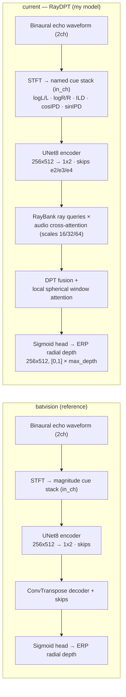

# Auto Audio Depth Estimation

Autonomous research — binaural echoes → ERP radial depth (SoundSpaces).

**Reference model** = BatVision U-Net (`base/`, plain pix2pix encoder→decoder, trained by
`run_base.py`). **My model** = the ray-conditioned RayDPT (`train.py`), iterated to beat the
reference under the same fixed split / target / metric / selection composite.

**Input representation** — named binaural cues, each on/off, plus a `use_log` switch
(`prepare.build_channel_names`): `logL/L, logR/R, ILD, cosIPD, sinIPD`. Default = all five,
`use_log=True` → the 5ch `[logL,logR,ILD,cosIPD,sinIPD]` stack.

## Visual results

Held-out val scenes — `RGB | GT depth | batvision | best1 | best2` (best1/best2 fill in as
improved "my model" checkpoints are found; RGB is unavailable in the simplified dataset).

Performance vs experiment (honest composite `rmse/1.6 + (1-d1)/0.46 + 0.35·abs_rel`, lower = better;
running best highlighted):

*Regenerate: `conda activate ss && python utils/report.py all`.*

## Results

<!-- RESULTS:START -->
| # | commit | ABS_REL | RMSE | d1 | composite | status | description |
|---|---|---|---|---|---|---|---|
| 1 | `209c6e8` | 0.4143 | 1.3186 | 0.5785 | 1.8854 | keep | E0 batvision U-Net 2ch [L,R] nolog, planar target, 26ep |
| 2 | `209c6e8` | 0.4211 | 1.3116 | 0.5808 | 1.8784 | keep | E1 batvision U-Net 2ch [logL,logR] log, planar target, 26ep |
<!-- RESULTS:END -->

## Progression (composite, lower = better)

| phase | best | note |
|---|---|---|
| 2026-June (archived) | ~2.030 | multi-res STFT + interaural coherence + TTA |
| 2026-July (this) | — | BatVision reference + named-cue inputs + fixed coarse/low loss target |

## Network flowchart

Two separate top-down networks — **current** (RayDPT, my model) on top, the **BatVision reference**
below:

