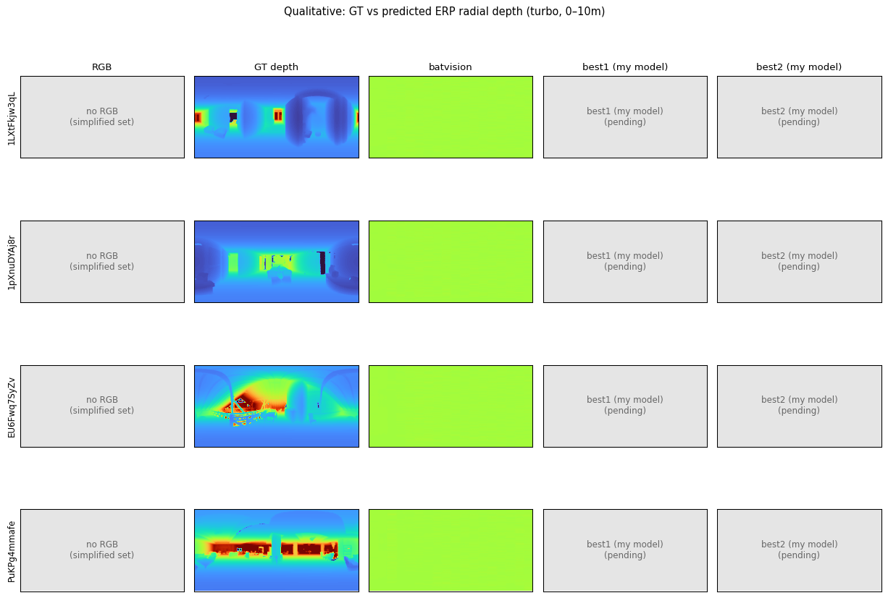
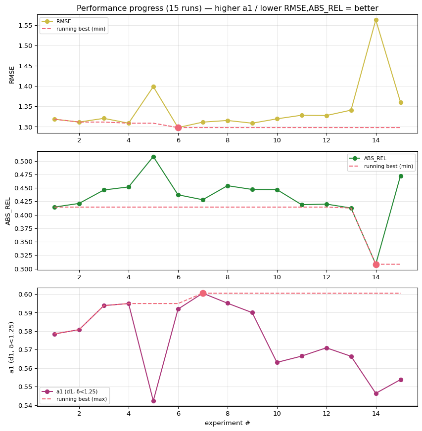
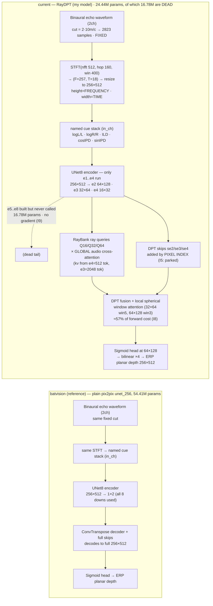

# Auto Audio Depth Estimation

Autonomous research — binaural echoes → ERP planar (cubemap) depth (SoundSpaces).

<!-- RESEARCH:START -->
## Autonomous research state

| | |
|---|---|
| **Mode** | `EXPLOIT` — adaptive HPO ladder 3 -> 5 -> 7 -> 10, each step justified by evidence -> PASS / FAIL |
| **Active study** | `F1` [tune] training-optimization (*running*) |
| **Research question** | The linear scaling rule is a heuristic for convnets under SGD, not a law for a residual attention stack. A model whose learning rate must be re-tuned for every architectural knob cannot be researched  |
| **Current action** | E20 --lr 6e-4, E21 --lr 3e-4, both on the fast defaults, --epochs 28, scored at the full budget. |
| **Latest result** | `E21` raydpt_e21_fast_lr3e4: composite **1.9099** (rmse None, d1 0.5706, abs_rel None), best epoch 19/25 |
| **Next decision** | Two criteria, in order. STABILITY: does mae ever jump more than 1.2x between epochs? A run that spikes answers nothing else. Then COMPOSITE against E11's 1.9093. Only once the fast config trains stabl |
| **Why this mode** | The efficiency phase is blocked on a tuning failure that I misdiagnosed once. Fix the optimiser before touching the architecture again. |

### Current hypothesis

- **General** — The linear scaling rule is a heuristic for convnets under SGD, not a law for a residual attention stack. A model whose learning rate must be re-tuned for every architectural knob cannot be researched quickly, whatever its FLOPs. Stability is a precondition for efficiency, not a detail of it.
- **Detailed** — lr = 3e-4 x (64/16) = 1.2e-3. E9/E11/E12 survived it; E15 (larger KV) and E17 (win32=3, ffn=2) did not, and E18 shows the failure is in the trunk rather than the coarse-layout auxiliary (which contributed zero gradient and diverged anyway). Gradient clipping is already 1.0. Sweep lr on the fast config; the mechanism is untouched.
- **Implementation note** — E20 --lr 6e-4, E21 --lr 3e-4, both on the fast defaults, --epochs 28, scored at the full budget.

### Research portfolio

| Idea | Mechanism family | Causal distance | Target bottleneck | Status | Next test |
|---|---|---|---|---|---|
| `I1` | acoustic-representation / temporal resolution | far | time-of-flight quantisation in the input representation | inconclusive | HOLD. Do not run more I1 arms. I10 (bilinear at hop=160) isolates the staircase; interpret |
| `I3` | training-optimization | near | the 1h wall-clock budget is spent on epochs that make the model worse | backlog | queue after the RayDPT planar re-anchor (E4); this is a confound affecting EVERY future ru |
| `I5` | ray conditioning / encoder-decoder correspondence | mid | RayDPT's DPT skip connections impose a FALSE spatial correspondence between the spectrogram's axes and the ERP's axes | inconclusive | none. Do not spend GPU on the skip ablation on this rationale. Revive only with an indepen |
| `I7` | sensing physics / angular resolution | far | two microphones may fundamentally under-determine high azimuthal frequencies | candidate | Do not chase high-frequency power as a goal. Re-test the observability claim once RayDPT c |
| `I10` | acoustic-representation / interpolation | mid | the nearest-neighbour resize in _features() turns the time axis into a coarse staircase | inconclusive | deferred confirm: run `--feat-interp bilinear --stft-hop 40` after the RayDPT throughput s |
| `I14` | ray conditioning / audio token routing | mid | far-field rays cannot see the late, weak echo that carries distance | probing | E16 (control) then E15b (treatment), both at lr 6e-4. Pre-registered falsification unchang |
| `I16` | throughput / experiment economics | near | iteration speed IS a research variable under a wall-clock budget | candidate | Answerable at last: E22 vs E20 isolates win32/ffn at matched lr. Until then the fast defau |
| `I19` | ray conditioning / physically-structured decoding | far | the model must LEARN that echo delay encodes depth, and it fails to, collapsing far surfaces toward the median | probing | E24 queued behind the attribution runs; the queue benchmarks cost first. |

### Open discrepancies

*Unexplained observations are research assets, not noise.*

- **`D2`** — Both 2ch cells peak at epoch 14 of 26 and both peak at exactly 2400.3 MB VRAM.
   *Why it matters:* The overfitting turn and the memory envelope are properties of the architecture + schedule, NOT of the input representation. This makes epoch count a CONFOUND for every comparison run under the fixed wall-clock budget: any change that slows an epoch silently reduces the epochs that fit, and is penalised for reasons unrelated to its mechanism.
- **`D7`** — The two I1 arms improved the composite through OPPOSITE metrics. Arm A (density only, smear unchanged): rmse -0.0227, d1 -0.0019. Arm B (6.2x finer smear): rmse -0.0093, d1 +0.0067 -- and B's RMSE is worse than A's despite B having vastly better temporal resolution.
   *Why it matters:* If temporal resolution set range accuracy, B should own RMSE. It does not; A does, and A did not change resolution at all. Meanwhile B, which also sacrifices frequency resolution (win 400 -> 64), buys ANGLE. That inverts the physical story: sharper transients seem to help azimuth cues (ILD/IPD are read across frequency and time), while range accuracy responds to something in the sampling/interpolation of the time axis.
- **`D8`** — E6 holds 29.7% LESS high-frequency azimuthal power than E2 (0.0232 vs 0.0331) yet has a BETTER d1 (0.6005 vs 0.5938). Separately, removing 58% of the gradient (E7 vs E3) barely changed the spectrum or the composite.
   *Why it matters:* It breaks the assumption -- mine, unstated until now -- that d1 improves because predictions get sharper. d1 counts pixels within +-25% of truth, and a well-centred smooth field beats a mis-placed sharp one. So the low-pass character of these models may be largely IRRELEVANT to the metric, and 'restore high frequencies' is probably the wrong research goal.

### Recent decisions

| When | Mode | Event | Note |
|---|---|---|---|
| 2026-07-10T20:48 | `exploit` | idea_added | STRUCTURAL, not a loss change. The encoder's width axis IS time, so e3's 64 columns are depth hypotheses (d = c*t/2, 0.08-9.92m).  |
| 2026-07-10T20:33 | `exploit` | experiment_completed | fast config at lr 3e-4: composite 1.9099, stable (max mae jump 0.99), converged (best ep19/25). Matches the E11 champion (1.9093)  |
| 2026-07-10T19:33 | `exploit` | experiment_completed | I18 CONFIRMED: at lr 6e-4 the fast config is stable (mae never rose between epochs, max ratio 0.99 vs 1.46/1.51 at lr 1.2e-3) and  |
| 2026-07-10T18:30 | `exploit` | experiment_completed | DIVERGED at ep7 despite w_coarse_layout=0, never recovered (val d1 0.5342 -> 0.1307; lc pinned at 0.1849, D_coarse saturated to a  |
| 2026-07-10T18:16 | `exploit` | candidate_dropped | PREMISE REFUTED BY ITS OWN EXPERIMENT. E18 removed lc from the loss entirely and the run still destabilised (mae x1.51 at epoch 7, |
| 2026-07-10T17:58 | `exploit` | experiment_completed | DIVERGED at epoch 5 (lc 0.0633 -> 0.3209, never recovers). Recorded as discard. Not a test of the fast knobs' accuracy -- a second |
| 2026-07-10T16:44 | `explore` | discrepancy_recorded | D11: E15 DIVERGED at epoch 4 with the parent's lr. The blow-up is entirely in lc, the coarse-layout term (0.4402 vs 0.0618) -- and |
| 2026-07-10T16:25 | `explore` | idea_added | From data already collected: E9 (cr32 on 2048 fine tokens) scores d1 0.2544 at GT 8-9m; E12 (512 coarse) only 0.1579. Far surfaces |

*Updated by `python utils/report.py research`. Champion: none yet.*
<!-- RESEARCH:END -->

**Reference model** = BatVision U-Net (`base/`, plain pix2pix encoder→decoder, trained by
`run_base.py`). **My model** = the ray-conditioned RayDPT (`train.py`), iterated to beat the
reference under the same fixed split / target / metric / selection composite.

**Input representation** — named binaural cues, each on/off, plus a `use_log` switch
(`prepare.build_channel_names`): `logL/L, logR/R, ILD, cosIPD, sinIPD`. Default = all five,
`use_log=True` → the 5ch `[logL,logR,ILD,cosIPD,sinIPD]` stack.

## Visual results

Held-out val scenes — `RGB | GT depth | batvision (2ch) | batvision (5ch) | current (my model)`.
The batvision reference gets exactly one column per channel count, always the **non-log** variant;
the log variants are still trained and logged to `out/results.tsv`. "my model" fills in as improved
RayDPT checkpoints are found. RGB is unavailable in the simplified dataset.

Performance vs experiment (honest composite `rmse/1.6 + (1-d1)/0.46 + 0.35·abs_rel`, lower = better;
running best highlighted):

*Regenerate: `conda activate ss && python utils/report.py all`.*

## Results

<!-- RESULTS:START -->
| # | commit | ABS_REL | RMSE | d1 | composite | status | description |
|---|---|---|---|---|---|---|---|
| 1 | `209c6e8` | 0.4143 | 1.3186 | 0.5785 | 1.8854 | keep | E0 batvision U-Net 2ch [L,R] nolog, planar target, 26ep |
| 2 | `209c6e8` | 0.4211 | 1.3116 | 0.5808 | 1.8784 | keep | E1 batvision U-Net 2ch [logL,logR] log, planar target, 26ep |
| 3 | `209c6e8` | 0.4460 | 1.3207 | 0.5938 | 1.8646 | keep | E2 batvision U-Net 5ch nolog, planar target, 25ep |
| 4 | `209c6e8` | 0.4517 | 1.3088 | 0.5949 | 1.8567 | keep | E3 batvision U-Net 5ch log, planar target, 25ep |
| 5 | `9dd3bce` | 0.5081 | 1.3987 | 0.5423 | 2.0470 | keep | E4 RayDPT planar anchor, 5ep ONLY (713s/ep), best=last ep, undertrained |
| 6 | `b9c2f71` | 0.4371 | 1.2980 | 0.5919 | 1.8514 | keep | E5 batvision 5ch nolog win400 hop40 (I1 arm A: density only), 26ep |
| 7 | `b9c2f71` | 0.4279 | 1.3114 | 0.6005 | 1.8379 | keep | E6 batvision 5ch nolog win64 hop16 (I1 arm B: true resolution), 25ep |
| 8 | `b9c2f71` | 0.4540 | 1.3155 | 0.5951 | 1.8613 | keep | E7 batvision 5ch log, aux losses ZEROED (I6 vs I7 discriminator) |
| 9 | `7fae910` | 0.4470 | 1.3088 | 0.5900 | 1.8658 | keep | E8 batvision 5ch nolog win400 hop160 BILINEAR resize (I10: staircase discriminator) |
| 10 | `bb9692d` | 0.4468 | 1.3195 | 0.5631 | 1.9309 | keep | E9 RayDPT decode32 xlayers1 batch64 lr1.2e-3 bf16 ep25 (S3: does a CONVERGED RayDPT beat a starved one?) |
| 11 | `bc415a2` | 0.4187 | 1.3284 | 0.5665 | 1.9192 | keep | E10 RayDPT decode32 xlayers2 batch64 (S4: was the cross-layer cut load-bearing?) |
| 12 | `c147692` | 0.4199 | 1.3276 | 0.5710 | 1.9093 | keep | E11 RayDPT decode32 xlayers2 kv=e4 batch64 (S5/H2: first CONVERGED 2-layer RayDPT) |
| 13 | `1b995ab` | 0.4125 | 1.3409 | 0.5664 | 1.9250 | keep | E12 RayDPT decode32 xlayers1 kv=e4 (S5 attribution: 2x2 missing cell) |
| 14 | `d38ecc7` | 0.3082 | 1.5628 | 0.5464 | 2.0707 | keep | E13 RayDPT E11 arch + rel_mae dense loss (S6/I13: far-field compression) |
| 15 | `d38ecc7` | 0.4724 | 1.3606 | 0.5538 | 1.9857 | keep | E14 RayDPT E11 arch + log_mae dense loss (S6/I13 discriminating arm) |
| 16 | `789c0be` | 0.5159 | 1.3988 | 0.5137 | 2.1120 | discard | E17 DIVERGED (lc saturated ep5) FAST default: E11 arch + win32=3 + ffn=2 (F0: does the speedup cost accuracy?) |
| 17 | `e4743b7` | 0.4491 | 1.3962 | 0.5342 | 2.0424 | discard | E18 DIVERGED ep7 despite w_coarse_layout=0 -> lc is a symptom, trunk is unstable (D11 corrected) |
| 18 | `0909a2d` | 0.4201 | 1.3386 | 0.5704 | 1.9176 | keep | E20 FAST config (win32=3 ffn=2) at lr 6e-4 (F1/I18: is the instability the optimiser?) |
| 19 | `0909a2d` | 0.4270 | 1.3231 | 0.5706 | 1.9099 | keep | E21 FAST config at lr 3e-4 (F1/I18 3-trial ladder) |
<!-- RESULTS:END -->

## Progression (composite, lower = better)

| phase | best | note |
|---|---|---|
| 2026-June (archived) | ~2.030 | multi-res STFT + interaural coherence + TTA |
| 2026-July (this) | — | BatVision reference + named-cue inputs + fixed coarse/low loss target |

## Network flowchart

Two separate top-down networks — **current** (RayDPT, my model) on top, the **BatVision reference**
below:

Both models consume the *same* input tensor and are trained by the same `composite_loss`
(`1.0·dense_MAE + 1.0·coarse_layout(16×32) + 0.5·low_pass(σ=3)`; the two auxiliaries carry
~58% of the gradient at convergence — see idea `I6`). The target is **planar** (cubemap
perpendicular-Z) ERP depth. The invariant that defines RayDPT is that depth is decoded **per
ray direction** from `RayBank` queries, never regressed from a global bottleneck.
