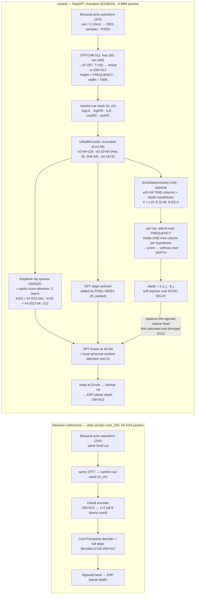

# Auto Audio Depth Estimation

Autonomous research — binaural echoes → ERP planar (cubemap) depth (SoundSpaces).

<!-- RESEARCH:START -->
## Autonomous research state

| | |
|---|---|
| **Mode** | `SYNTHESIZE` — no runs; review evidence, find contradictions, pick the highest-information next question |
| **Active study** | `H1` [refine] depth-objective (*concluded*) |
| **Research question** | The near-field median-pull is loss-shaped (E34 confirmed the histogram moves) but plain log_mae cancels its own gain by loosening the over-prediction tail. A loss that is quadratic inside d1's +-25% b |
| **Current action** | E35 --main-loss log_huber on the champion. |
| **Latest result** | `E35` raydpt_e35_loghuber: composite **1.9091** (rmse None, d1 None, abs_rel None), best epoch None/None |
| **Next decision** | 1-2m interior d1 must beat BOTH E23 and E34, with the >1.25 tail not exceeding E23's 15.0%. Judge on the interior histogram; ABS_REL is not evidence. If the tail still grows, the near-field pull is no |
| **Why this mode** | Both remaining deficits are now characterised as ceilings: the far field is sensor-limited (D13, five runs), and the near field's median-pull is real but not loss-shapeable into d1 (H0/H1, three loss  |

### Current hypothesis

- **General** — The near-field median-pull is loss-shaped (E34 confirmed the histogram moves) but plain log_mae cancels its own gain by loosening the over-prediction tail. A loss that is quadratic inside d1's +-25% band and linear outside should centre the bulk without the tail cost.
- **Detailed** — log_huber, delta=log(1.25). Controls E23 (mae) and E34 (log_mae) bracket it: mae centres nothing, log_mae centres but loosens the tail, log_huber should centre AND hold the tail.
- **Implementation note** — E35 --main-loss log_huber on the champion.

### Research portfolio

| Idea | Mechanism family | Causal distance | Target bottleneck | Status | Next test |
|---|---|---|---|---|---|
| `I1` | acoustic-representation / temporal resolution | far | time-of-flight quantisation in the input representation | inconclusive | HOLD. Do not run more I1 arms. I10 (bilinear at hop=160) isolates the staircase; interpret |
| `I3` | training-optimization | near | the 1h wall-clock budget is spent on epochs that make the model worse | backlog | queue after the RayDPT planar re-anchor (E4); this is a confound affecting EVERY future ru |
| `I5` | ray conditioning / encoder-decoder correspondence | mid | RayDPT's DPT skip connections impose a FALSE spatial correspondence between the spectrogram's axes and the ERP's axes | inconclusive | none. Do not spend GPU on the skip ablation on this rationale. Revive only with an indepen |
| `I7` | sensing physics / angular resolution | far | two microphones may fundamentally under-determine high azimuthal frequencies | candidate | Do not chase high-frequency power as a goal. Re-test the observability claim once RayDPT c |
| `I10` | acoustic-representation / interpolation | mid | the nearest-neighbour resize in _features() turns the time axis into a coarse staircase | inconclusive | deferred confirm: run `--feat-interp bilinear --stft-hop 40` after the RayDPT throughput s |
| `I14` | ray conditioning / audio token routing | mid | far-field rays cannot see the late, weak echo that carries distance | probing | E16 (control) then E15b (treatment), both at lr 6e-4. Pre-registered falsification unchang |
| `I19` | ray conditioning / physically-structured decoding | far | the model must LEARN that echo delay encodes depth, and it fails to, collapsing far surfaces toward the median | inconclusive | Do NOT crown. Test the ONE compatible combination the scope predicts: EchoDelayVolume + fi |
| `I24` | reframing / where-the-gain-is | n/a (redirection) | the 1-2 m near field, which is 52.5% of pixels and over half the total d1 gap to batvision | candidate | A near-field compression cure that is NOT time-resolution: candidates are (a) a small per- |
| `I27` | depth objective | mid | near-field median-pull: the loss must optimise the geometric median, which requires the LOSS in log space, not the output | inconclusive | Either a Huber-log loss (centre without loosening the tail), or accept that the near-field |

### Open discrepancies

*Unexplained observations are research assets, not noise.*

- **`D2`** — Both 2ch cells peak at epoch 14 of 26 and both peak at exactly 2400.3 MB VRAM.
   *Why it matters:* The overfitting turn and the memory envelope are properties of the architecture + schedule, NOT of the input representation. This makes epoch count a CONFOUND for every comparison run under the fixed wall-clock budget: any change that slows an epoch silently reduces the epochs that fit, and is penalised for reasons unrelated to its mechanism.
- **`D7`** — The two I1 arms improved the composite through OPPOSITE metrics. Arm A (density only, smear unchanged): rmse -0.0227, d1 -0.0019. Arm B (6.2x finer smear): rmse -0.0093, d1 +0.0067 -- and B's RMSE is worse than A's despite B having vastly better temporal resolution.
   *Why it matters:* If temporal resolution set range accuracy, B should own RMSE. It does not; A does, and A did not change resolution at all. Meanwhile B, which also sacrifices frequency resolution (win 400 -> 64), buys ANGLE. That inverts the physical story: sharper transients seem to help azimuth cues (ILD/IPD are read across frequency and time), while range accuracy responds to something in the sampling/interpolation of the time axis.
- **`D8`** — E6 holds 29.7% LESS high-frequency azimuthal power than E2 (0.0232 vs 0.0331) yet has a BETTER d1 (0.6005 vs 0.5938). Separately, removing 58% of the gradient (E7 vs E3) barely changed the spectrum or the composite.
   *Why it matters:* It breaks the assumption -- mine, unstated until now -- that d1 improves because predictions get sharper. d1 counts pixels within +-25% of truth, and a well-centred smooth field beats a mis-placed sharp one. So the low-pass character of these models may be largely IRRELEVANT to the metric, and 'restore high frequencies' is probably the wrong research goal.

### Recent decisions

| When | Mode | Event | Note |
|---|---|---|---|
| 2026-07-12T06:00 | `synthesize` | experiment_completed | log_huber held the tail exactly as designed (>1.25: 14.6% < E23's 15.0% < E34's 16.2%) but under-centred the bulk (+1.4% vs log_ma |
| 2026-07-12T04:58 | `exploit` | idea_added | log_huber: Huber on the log-ratio with delta=log(1.25)=0.223, exactly d1's +-25% band. Quadratic inside (centres the 1-2m bulk 4x  |
| 2026-07-12T04:46 | `synthesize` | experiment_completed | log_mae LOSS on champion: HALF-confirmed. The 1-2m ratio histogram moved exactly as predicted (0.9-1.0 pile 32.1->29.1%, centre 1. |
| 2026-07-12T03:44 | `exploit` | candidate_dropped | FAILED pre-registered near-field test: 1-2m interior d1 unmoved (0.7523->0.7521), ratio histogram unchanged. Re-parameterising the |
| 2026-07-12T02:53 | `exploit` | experiment_completed | log-depth output: composite 1.9102 vs E23 1.8962 (+0.0140 worse), overall d1 -0.0044, converged. NOT the test -- the pre-registere |
| 2026-07-12T01:42 | `exploit` | idea_added | log-depth output cures near-field median-pull. d1 is a +-25% ratio threshold; masked-MAE on linear depth converges to the arithmet |
| 2026-07-12T01:31 | `synthesize` | discrepancy_recorded | Near-field diagnosis (1-2m, 52.5% of pixels): the gap is INTERIOR (flat walls), not boundary -- ties batvision on edges (0.4447 vs |
| 2026-07-12T01:27 | `synthesize` | direction_changed | Representation lever OPENED per request and REFUTED at zero GPU: coherence correlates +0.17 (wrong sign) and late-tail waveform en |

*Updated by `python utils/report.py research`. Champion: none yet.*
<!-- RESEARCH:END -->

**Reference model** = BatVision U-Net (`base/`, plain pix2pix encoder→decoder, trained by
`run_base.py`). **My model** = the ray-conditioned RayDPT (`train.py`), iterated to beat the
reference under the same fixed split / target / metric / selection composite.

**Input representation** — named binaural cues, each on/off, plus a `use_log` switch
(`prepare.build_channel_names`): `logL/L, logR/R, ILD, cosIPD, sinIPD`. Default = all five,
`use_log=True` → the 5ch `[logL,logR,ILD,cosIPD,sinIPD]` stack.

## Visual results

Held-out val scenes — `RGB | GT depth | batvision (2ch) | batvision (5ch) | current (my model)`.
The batvision reference gets exactly one column per channel count, always the **non-log** variant;
the log variants are still trained and logged to `out/results.tsv`. "my model" fills in as improved
RayDPT checkpoints are found. RGB is unavailable in the simplified dataset.

Performance vs experiment (honest composite `rmse/1.6 + (1-d1)/0.46 + 0.35·abs_rel`, lower = better;
running best highlighted):

*Regenerate: `conda activate ss && python utils/report.py all`.*

## Results

<!-- RESULTS:START -->
| # | commit | ABS_REL | RMSE | d1 | composite | status | description |
|---|---|---|---|---|---|---|---|
| 1 | `209c6e8` | 0.4143 | 1.3186 | 0.5785 | 1.8854 | keep | E0 batvision U-Net 2ch [L,R] nolog, planar target, 26ep |
| 2 | `209c6e8` | 0.4211 | 1.3116 | 0.5808 | 1.8784 | keep | E1 batvision U-Net 2ch [logL,logR] log, planar target, 26ep |
| 3 | `209c6e8` | 0.4460 | 1.3207 | 0.5938 | 1.8646 | keep | E2 batvision U-Net 5ch nolog, planar target, 25ep |
| 4 | `209c6e8` | 0.4517 | 1.3088 | 0.5949 | 1.8567 | keep | E3 batvision U-Net 5ch log, planar target, 25ep |
| 5 | `9dd3bce` | 0.5081 | 1.3987 | 0.5423 | 2.0470 | keep | E4 RayDPT planar anchor, 5ep ONLY (713s/ep), best=last ep, undertrained |
| 6 | `b9c2f71` | 0.4371 | 1.2980 | 0.5919 | 1.8514 | keep | E5 batvision 5ch nolog win400 hop40 (I1 arm A: density only), 26ep |
| 7 | `b9c2f71` | 0.4279 | 1.3114 | 0.6005 | 1.8379 | keep | E6 batvision 5ch nolog win64 hop16 (I1 arm B: true resolution), 25ep |
| 8 | `b9c2f71` | 0.4540 | 1.3155 | 0.5951 | 1.8613 | keep | E7 batvision 5ch log, aux losses ZEROED (I6 vs I7 discriminator) |
| 9 | `7fae910` | 0.4470 | 1.3088 | 0.5900 | 1.8658 | keep | E8 batvision 5ch nolog win400 hop160 BILINEAR resize (I10: staircase discriminator) |
| 10 | `bb9692d` | 0.4468 | 1.3195 | 0.5631 | 1.9309 | keep | E9 RayDPT decode32 xlayers1 batch64 lr1.2e-3 bf16 ep25 (S3: does a CONVERGED RayDPT beat a starved one?) |
| 11 | `bc415a2` | 0.4187 | 1.3284 | 0.5665 | 1.9192 | keep | E10 RayDPT decode32 xlayers2 batch64 (S4: was the cross-layer cut load-bearing?) |
| 12 | `c147692` | 0.4199 | 1.3276 | 0.5710 | 1.9093 | keep | E11 RayDPT decode32 xlayers2 kv=e4 batch64 (S5/H2: first CONVERGED 2-layer RayDPT) |
| 13 | `1b995ab` | 0.4125 | 1.3409 | 0.5664 | 1.9250 | keep | E12 RayDPT decode32 xlayers1 kv=e4 (S5 attribution: 2x2 missing cell) |
| 14 | `d38ecc7` | 0.3082 | 1.5628 | 0.5464 | 2.0707 | keep | E13 RayDPT E11 arch + rel_mae dense loss (S6/I13: far-field compression) |
| 15 | `d38ecc7` | 0.4724 | 1.3606 | 0.5538 | 1.9857 | keep | E14 RayDPT E11 arch + log_mae dense loss (S6/I13 discriminating arm) |
| 16 | `789c0be` | 0.5159 | 1.3988 | 0.5137 | 2.1120 | discard | E17 DIVERGED (lc saturated ep5) FAST default: E11 arch + win32=3 + ffn=2 (F0: does the speedup cost accuracy?) |
| 17 | `e4743b7` | 0.4491 | 1.3962 | 0.5342 | 2.0424 | discard | E18 DIVERGED ep7 despite w_coarse_layout=0 -> lc is a symptom, trunk is unstable (D11 corrected) |
| 18 | `0909a2d` | 0.4201 | 1.3386 | 0.5704 | 1.9176 | keep | E20 FAST config (win32=3 ffn=2) at lr 6e-4 (F1/I18: is the instability the optimiser?) |
| 19 | `0909a2d` | 0.4270 | 1.3231 | 0.5706 | 1.9099 | keep | E21 FAST config at lr 3e-4 (F1/I18 3-trial ladder) |
| 20 | `7bf10af` | 0.4132 | 1.3357 | 0.5708 | 1.9125 | keep | E22 CONTROL win5 ffn4 @ lr 6e-4 (F1 attribution: knobs vs lr) |
| 21 | `1c34d7c` | 0.4131 | 1.3295 | 0.5765 | 1.8962 | keep | E23 CONTROL win5 ffn4 @ lr 3e-4 (F1 attribution: closes the 2x2) |
| 22 | `a7b0613` | 0.4203 | 1.3183 | 0.5733 | 1.8987 | keep | E24 EchoDelayVolume: per-ray soft-argmax over echo delay (G0/I19 structural) |
| 23 | `0a858e4` | 0.4238 | 1.3307 | 0.5730 | 1.9083 | keep | E25 CHAMPION arch + EchoDelayVolume (G0/I19 on the correct parent) |
| 24 | `9a26c0c` | 0.4301 | 1.3382 | 0.5675 | 1.9271 | keep | E27 CHAMPION + EchoDelayVolume, epochs matched to budget (G1b/I19) |
| 25 | `00bdb13` | 0.4128 | 1.3228 | 0.5725 | 1.9006 | keep | E29 EchoDelayVolume on e2 (time 128, 2x delay resolution) fast parent (G1/I20) |
| 26 | `00bdb13` | 0.4528 | 1.3372 | 0.5600 | 1.9508 | keep | E30 EchoDelayVolume + cross_kv32=e3 (combine, fast parent) (G1/I21) |
| 27 | `b066475` | 0.4350 | 1.3108 | 0.5725 | 1.9008 | keep | E31 EchoDelayVolume reads raw STFT (time 512, encoder time-pooling bypassed) (G2/I22) |
| 28 | `54678e3` | 0.4166 | 1.3346 | 0.5721 | 1.9102 | keep | E32 log-depth output (I25: cure near-field median-pull) |
| 29 | `54678e3` | 0.4197 | 1.3152 | 0.5722 | 1.8989 | keep | E33 log-depth output + EchoDelayVolume (I26 combine) |
| 30 | `61ef585` | 0.4210 | 1.3230 | 0.5750 | 1.8981 | keep | E34 log_mae LOSS on champion (I27: geometric-median objective for near-field) |
| 31 | `70b2eed` | 0.3870 | 1.3414 | 0.5698 | 1.9090 | keep | E35 log_huber LOSS on champion (I28: centre + hold tail for near-field) |
<!-- RESULTS:END -->

## Progression (composite, lower = better)

| phase | best | note |
|---|---|---|
| 2026-June (archived) | ~2.030 | multi-res STFT + interaural coherence + TTA |
| 2026-July (this) | — | BatVision reference + named-cue inputs + fixed coarse/low loss target |

## Network flowchart

Two separate top-down networks — **current** (RayDPT, my model) on top, the **BatVision reference**
below:

Both models consume the *same* input tensor and are trained by the same `composite_loss`
(`1.0·dense_MAE + 1.0·coarse_layout(16×32) + 0.5·low_pass(σ=3)`; the two auxiliaries carry
~58% of the gradient at convergence yet are measurably **inert** — see idea `I6`). The target is
**planar** (cubemap perpendicular-Z) ERP depth. The invariant that defines RayDPT is that depth is
decoded **per ray direction** from `RayBank` queries, never regressed from a global bottleneck.

The key structural fact, and the one `EchoDelayVolume` exploits: **the encoder's width axis is
time.** An echo from a surface at depth `d` arrives at `t = 2d/c`, so `e3`'s 64 time columns are
depth hypotheses spanning 0.08–9.92 m. Rather than making the network *learn* that correspondence,
`I19` lets each ray attend over **frequency** inside a single time column per hypothesis (azimuth
lives in the per-frequency ILD/IPD) and takes a **soft-argmax over echo delay**. Measured against
its matched control, every far decile improved (7–8 m +0.069, 8–9 m +0.076, 9–10 m +0.060) and the
mean predicted depth of a true 8.5 m surface rose from 4.76 m to 5.24 m.
